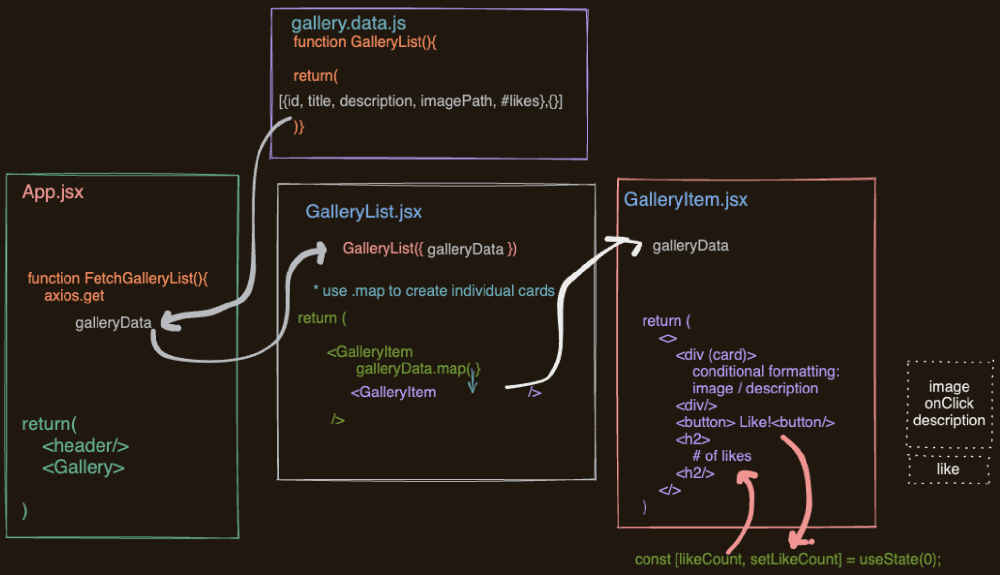

# Weekend React Gallery

[Project Instructions](./INSTRUCTIONS.md), this line may be removed once you have updated the README.md

## Description

This weekend project required me to use my newly learned skills using React. I began by first creating a visual layout (pictured below) of what components I intended to use and the general flow of props from each component. Having a visual layout of the problem helps me get a clear picture of what needs to be done to accomplish the task. It also prevents me from diving straight into the code which I have learned the hard way from previous projects is not the best approach.

The assignment was to create an image gallery that displays images with a button that would allow the user to love the image. Clicking the (❤️) button updates the text below the image with the amount of times it has been loved. Additionally, I had to include conditional rendering for toggling between the image and a description of the image. 

A big lesson learned while working on this project was to carefully look through all of the code provided in the files. Not recognizing the correct url needed for a 'PUT' request cost me a lot of project time that could have otherwise been spent attempting some of the stretch goals.  

